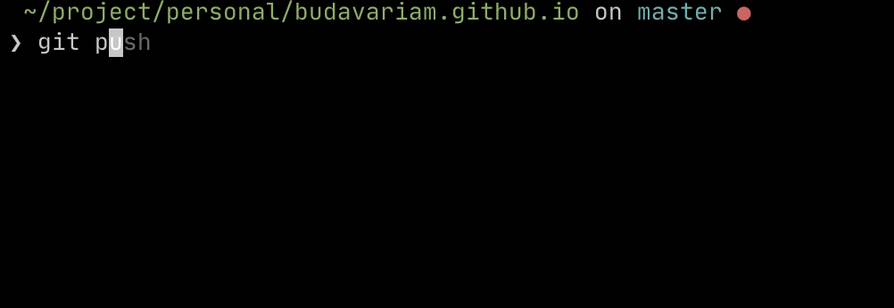

The commmand line can be your best friend during development, if you take some time to get to know its capabilities.
But even if you know what it can help you with, you can still extend it.
I'd like to introduce you some of my favourite tools, `fzf`, and `oh-my-zsh`.
By the end of this post I hope you'll see how well they can work together with you.

<!--more-->

## oh-my-zsh

I've always enjoyed tweaking my command line configurations, but usually when I needed a functionality,
I had to sit down and understand my code again to figure out where to put the new logic.

Last year I've found [oh-my-zsh](https://github.com/ohmyzsh/ohmyzsh), and I felt relieved.
It makes it easy to create an easily managable config, nice themes and it is easily pluginable.
It has a nice community that creates and shares their work.

- [Install git](https://git-scm.com/book/en/v2/Getting-Started-Installing-Git)
- [Install zsh](https://github.com/ohmyzsh/ohmyzsh/wiki/Installing-ZSH)
- [Install oh-my-zsh](https://github.com/ohmyzsh/ohmyzsh#basic-installation)

My favourite feature in it, other than its simplicity, is that zsh makes tab completion navigatable,
so you can use the arrow keys to select the appropriate value that you were searching for.

An other great built-in command is `fc`, that opens up my editor and lets me edit the previous command and run it after save.

Zsh comes [embedded with plugins](https://github.com/ohmyzsh/ohmyzsh/tree/master/plugins) for commonly used commands like
git, docker and kubernetes.
It empowers them with aliases, command prompt information, also extends their tab completion by
helping with available field names and lets you browse resources.

New plugins can be installed usually with 2 lines of code, one of which is a `git clone`,
the other is editing the `plugins` list in `.zshrc`. Their configuration usually means to set some environmental variables.

## fzf

[fzf](https://github.com/junegunn/fzf) is a general purpose command line fuzzy finder.

- [Install guide](https://github.com/junegunn/fzf#installation).

It makes it easy to filter data by typing any part of the line.

You can pipe data into it, or filter file content from your disk.

I like the recommended settings, that way it stands out, from the other lines.

```bash
export FZF_DEFAULT_OPTS='--height 40% --layout=reverse --border'
```


## Autocomplete

Many shells come with command history navigation helper shortcut `ctrl+R`,
but in the past it usually confused me more than what it helped.

I often just ended up using `history | less` and search through lines with `/`.

Plugins for the rescue!

### zsh-autosuggestions

[This plugin](https://github.com/zsh-users/zsh-autosuggestions) lets me see autosuggestions for my commands.

- [Install guide](https://github.com/zsh-users/zsh-autosuggestions/blob/master/INSTALL.md).

It makes me feel super productive, when I often need to use the same set of commands in a project in order to run, build or test it.

When I start to type the commands, I can accept the suggestion with a simple `right arrow` click.



If I need to search for a complex command there is a better way for that!

### fzf in zsh

Fzf can be [integrated](https://github.com/ohmyzsh/ohmyzsh/tree/master/plugins/fzf) with `oh-my-zsh`.

- No further installation needed, only need to add `fzf` to the plugin array in `.zshrc`.

It is super convenient to fuzzy search for previous commands with `ctrl+R`.
It can find my previously typed command from just a few keystrokes.

It is also useful to insert file name from the current subtree with `ctrl+T`.

### Enhance zsh tab completion with fzf

As I mentioned above, zsh comes with navigatable tab completion, but unfortunately the fzf plugin do not attach in every case.
Not so long ago I've found a great plugin, [fzf-tab](https://github.com/Aloxaf/fzf-tab) that lets you use fzf in every situation.

- [Install guide](https://github.com/Aloxaf/fzf-tab#install).

You have the option to toggle it temporarily with `toggle-fzf-tab`,
because sometimes it might not be what you need, maybe there are too many options, or too slow in special cases.


## My zsh config

For reference my zsh config is available [here](https://github.com/budavariam/dotfiles/blob/master/_mac/zsh/.zshrc).
The interesting part is the plugins section.
With only a few lines of code, the plugins come alive.

```bash
# fzf configurations
export FZF_DEFAULT_OPTS='--height 40% --layout=reverse --border'
# Uncomment the following line to disable fuzzy completion
# export DISABLE_FZF_AUTO_COMPLETION="true"
# Uncomment the following line to disable key bindings (CTRL-T, CTRL-R, ALT-C)
# export DISABLE_FZF_KEY_BINDINGS="true"

plugins=(
  fzf-tab # to turn it on and off: toggle-fzf-tab
  zsh-autosuggestions
  fzf
)
```

> In case it may be changed this is how it looks like at the time of writing.

I've tried `zsh-syntax-highlighting`, but is did not really like long commands, or pasted code, so I turnded it off.

Happy coding!
