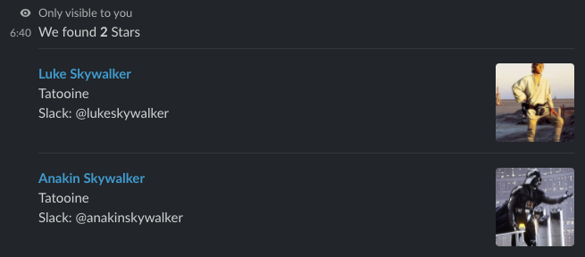

In Hungary, around the end of the year, we usually have some mandatory transferred workdays,
when we have to work on Saturdays instead of the days around holidays.
It's not unusual for companies to let their workers spend their time in a more fun way,
that's what we did with an optional hackathon.

<!--more-->

## Rough start

When we formed our team before the event, we decided to create a Slack bot to speed up our administration processes.
Our team was split up between 2 cities.

On the morning of the competition, I started to look into the necessary REST APIs,
searched through the internet for more detailed docs.
After a few hours, we reached the point where our plan seemed feasible.

## Getting into Slack bot development

I had some experience with the now disregarded [slack webhooks](https://api.slack.com/legacy/custom-integrations/messaging/webhooks).
Therefore I jumped out of this field to look into how shall we enable interactivity and slash commands,
to make our processes more powerful and user-friendly.
I searched through docs and tutorials, switched between Python and JavaScript
until I stumbled upon a [github repo](https://github.com/jainishshah17/slack-weather-bot),
that promised what I was looking for in the simplest possible way.
I fired it up and started to put together the UI in the [block kit builder](https://app.slack.com/block-kit-builder).

## A big surprise

Soon after the others dug even deeper into the systems we needed to connect,
they realized it's not a simple task,
that we would be able to finish in the remaining 4 hours.

Sooooo a change of plans! We found another problem that affects many people,
and we can solve it quickly with the tools we already have.

When someone joins the company, it's hard for them to instantly know everyone by name.
It's better, if they can associate a face with the names.
We already have a site for that, but it would be so much better if we could get
that information right in Slack instead of loading the website up.
We live in Slack anyways. So we started to make it happen.

And by we, I mean I.

Unfortunately, I had everything in my machine, and we needed to act fast and make changes in a single file.
We could have set up a git repo or [VSCode Live Share](https://code.visualstudio.com/blogs/2017/11/15/live-share),
but we were in a hurry, and I'm used to pair-programming through screen share.

It was fun to delegate out Slack admin configurations,
UI design and templating for the others while I made sure everything ran smoothly on my machine.

## Result

The app is fairly simple. After the proper connection it just waits for
POST messages from Slack, validates the messages and sends back the search results.

We were able to put together a working POC for the demo.
We presented it first without significant glitches in the Slack part.

I don't want to put out the final result in the wild, with the exact fields and URLs.
But I stripped out its essence for a showcase and future reference.
It's on [github](https://github.com/budavariam/hackathon-slack-bot).

I know that there are better options to accomplish this task,
and this base repo is now 2 years old, with deprecated modules.
I felt confident to move fast, and I sticked with a working solution
instead of wasting time trying to spin up shiny new components.

## Useful docs

At the end of the day, I learned how slack slash commands work,
and was able to put together a nice-looking slack message from the building blocks.
These pages helped me along the way:

- [Slack Slash commands](https://api.slack.com/interactivity/slash-commands)
- [Block Kit](https://api.slack.com/block-kit)
- [Block Kit docs](https://app.slack.com/block-kit-builder)
- [Block Kit Reference](https://api.slack.com/reference/block-kit/block-elements#input)
- [Slack apps](https://api.slack.com/apps/)
- [Slack docs](https://api.slack.com/workflows)
- [Slack API node.js tutorials](https://api.slack.com/tutorials/tags/node.js)

## Summary

I felt amazing at the end. Finally, we had accomplished something helpful in such a short timeframe.
I hope I can participate in similar events in the future.

Cover Photo by [Tima Miroshnichenko](https://www.pexels.com/@tima-miroshnichenko) from
[Pexels](https://www.pexels.com/photo/close-up-view-of-system-hacking-in-a-monitor-5380664/)

Happy coding!
