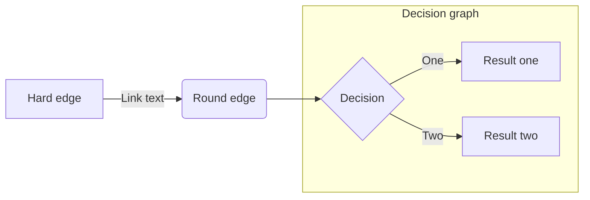
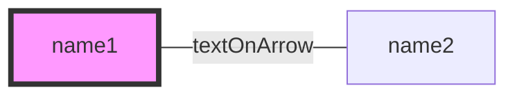

A picture is worth a thousand words. It's easier to explain the architecture and data flows with diagrams, than with lengthy paragraps.

Developers like to stick to their text editors.
[Mermaid](https://mermaid-js.github.io/mermaid/) lets them create flowcharts, sequence diagrams, pie charts and many more diagrams in a declarative way.

<!--more-->

Previously I created my diagrams in external editors, it was not the best experience to load and export data
compared to writing down what I want to show up in the image and have it instantly.

Mermaid can export the generated images as `.png`, `.svg` or even `.pdf`.

Github [announced](https://github.blog/2022-02-14-include-diagrams-markdown-files-mermaid/) first level support for mermaid diagrams this february.
It was the first time I heard about this library,
I've been wanting to try it eeveer since.
Now I finally got a chance to draw some flowcharts.



## Flowchart

Mermaid docs defines the [basic syntax](https://mermaid-js.github.io/mermaid/#/./flowchart?id=flowcharts-basic-syntax) with simple examples.

### Basic flowchart example





Let's see what we got here:

- `flowchart` followed by orientation
  - `TB` / `TD` - top to bottom
  - `BT` - bottom to top
  - `RL` - right to left
  - `LR` - left to right
- Any single word by itself is a new node
- The nodes can be connected together by edges
- The text on nodes and edges can be customized
- Single line comments start with `%%`

## Styling

The [docs](https://mermaid-js.github.io/mermaid/#/flowchart?id=styling-and-classes) has more info on styling.

### Basic styling example





## CLI

Mermaid has a command-line interface available on [github](https://github.com/mermaid-js/mermaid-cli).

```bash
# Convert Mermaid mmd Diagram File To SVG
mmdc -i input.mmd -o output.svg
# Create A PNG With A Dark Theme And Transparent Background
mmdc -i input.mmd -o output.png -t dark -b transparent
```



## Summary

Mermaid has powerful syntax.
If you host your code on github, your mermaid diagrams can appear without any further configuration.
Otherwise you still have thee option to generate the images with a CLI tool.

Happy coding!

Cover Photo by [C1superstar](https://www.pexels.com/@c1superstar-24564633/) from [Pexels](https://www.pexels.com/photo/the-statue-of-the-little-mermaid-on-a-rock-in-copenhagen-denmark-7874460/)
