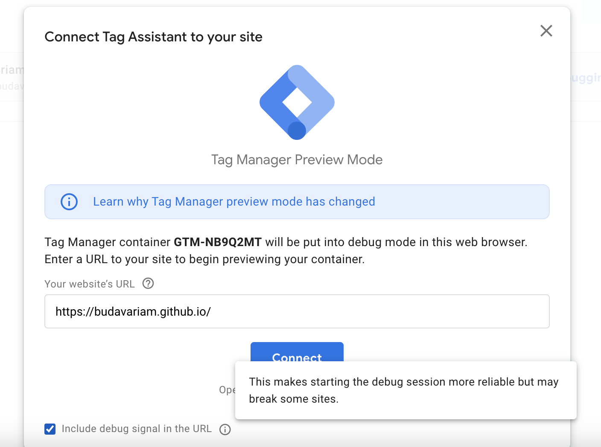

I just started to get to know how ads work, I'm going to experiment with the different capabilities of Google AdSense and how it can be connected with Google Analytics.

<!--more-->

I fired up AdSense and started to learn more about Google Analytics v4.
I've used Google Analytics v3 (Universal Analytics) before, but it's [going to be deprecated](https://support.google.com/analytics/answer/11583528?hl=en) next year.

## Libs I Use for my Site

I build my blog using [Hugo](https://gohugo.io/documentation/),one of the static site generation tool I've used.
I customized my theme based on the [PaperMod theme](https://github.com/budavariam/hugo-PaperMod/tree/budavariam) of [adityatelange](https://github.com/adityatelange). This theme is based on the minimalistic [Paper](https://github.com/nanxiaobei/hugo-paper) theme.

## Tools that Seems Promising

I'd like to gain some experience in the **analytics** part of the applications.
I mostly develop internal tools in closed networks, so I lack the proper experience
of this from my ususal day-to-day life.

Let's see how can I analyze my site.

### Performance Analysis

The first rule is that the site has to be performant to keep its users.

But what is considered good? I have to measure it sommehow.

Google has some web developer tools that comme in handy.

[Lighthouse test](https://developer.chrome.com/docs/lighthouse/overview/) is available in Chrome (open in DevTools).
Earlier it had a separate extension now it's convenient to reach.

You can analyze and optimize your website with **PageSpeed** tools.
Here are the links that analyze my site:

- [PageSpeed mobile](https://pagespeed.web.dev/report?url=https%3A%2F%2Fbudavariam.github.io%2F&form_factor=mobile)
- [PageSpeed desktop](https://pagespeed.web.dev/report?url=https%3A%2F%2Fbudavariam.github.io%2F&form_factor=desktop)

### Google Analytics

[Google Analytics](https://analytics.google.com/analytics/web/) is the most popular analytics tool available. It's free to use.

You can find more info at the [Analytics Docs](https://developers.google.com/analytics).

In case you don't have enough data you can enable some [demo accounts](https://support.google.com/analytics/answer/6367342?hl=en#zippy=%2Cin-this-article) where you can explore its possibilities.

Nowadays it's called GA4. GA3 was called Universal analytics, it's going to be [deprecated in 2023](https://blog.google/products/marketingplatform/analytics/prepare-for-future-with-google-analytics-4/?utm_campaign=2022-q1-gbl-all-gafree).x

#### Google Analytics 4 Tutorial for Beginners

This video below helped me get started with GA4.



### Google AdSense

[AdSense](https://www.google.com/adsense/start/) is a platform where you can set how your advertisements will show up.

> AdSense acts as an ad network, providing you access to demand from advertisers and helping you set up your ad inventory. AdSense is best for publishers who want more automation for their ad solutions, and have a small dedicated ad management team.

Okay, then what's the difference between **Ad Manager**, **AdSense**, and **AdMob**? [See this post for details](https://support.google.com/admob/answer/9234653?hl=en).

### Google Tag Manager

In Google Analytics 4 collects **events** instead of sessions.
Google [Tag Manager](https://tagmanager.google.com/) helps you define events in a graphical interface **without any coding** necessary. You can propagate changes in your analytics without having to redeploy your site with new data.

For complex usecases you can use [gtag.js](https://developers.google.com/tag-platform/gtagjs/configure) alongside the Tag Manager.

Upon developing your components [Tag Assistant](https://tagassistant.google.com/) helps you **preview** your different tags.

#### Working with Google Analytics alongside Tag Manager

Google Analytics4 collects many events by default. In case you want to add custom events they have **recommended naming conventions** that can be found at [Recommended events](https://support.google.com/analytics/answer/9267735?hl=en) page.

These events can have **parameters**. The names under [Enhanced measurement events](https://support.google.com/analytics/answer/9216061?hl=en) are already usable in your custom events. However, if you want to use other parameters, you **have to** add them at `Google Analytics > Configure > custom Definitions`. Otherwise the new parameters won't be saved although might show up in DebugView.

You can start a **preview mode in Tag Assistant**, and if you turn on **Debug signal** you can check the events in `Google Analytics > Configure > DebugView` as well.

#### Google Tag Manager Tutorial for Beginners

This video below helped me get started with Google Tag Manager.



### Google Search Console

In case you're more into **SEO** aka search engine optimization, you can look how oother people find your site through google at the [Google Search Console](https://developers.google.com/search).

[Search Console Insights](https://search.google.com/search-console/insights/u/0/about) show quickly digestible information about how your site performs currently.

Whoever have access can see [my site data](https://search.google.com/search-console?resource_id=https://budavariam.github.io/), and its [Search Console Insights](https://search.google.com/search-console/insights/u/0?resource_id=https://budavariam.github.io/).

## Summary

I see that there's a lot to learn in this area, and I'm starting to dive deeper into it.

Happy coding!
