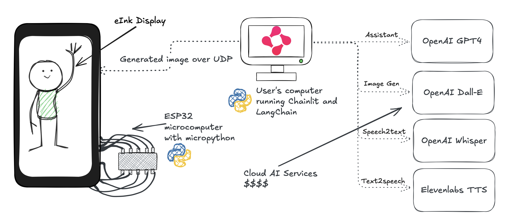

Today was a moved working day because Hungarian national holiday 20th of August is going to be a Tuesday,
and we won't work on Monday.
In our company if it's a Saturday working day it most likely means that there is a hackathon!

This time I haven't found a project beforehand that I could fully align with,
and the one I considered joining already had a bunch of people.
This time I wanted to create something, and learn new stuff.
In the morning I packed a bunch of microcontrollers, sensors, displays in hopes that I could tinker with them,
and explore it together with someone.
After orientation, I met a colleague who was planning on working alone on an open source project related to robotics,
it was a match made in heaven.

The topic of the hackathon was: *Make us think of make us wow*.

We needed to do something awesome.



## Our Idea

After some brainstorming and looking at the different displays and sensors,
we decided to make Smart Picture frame, that you can communicate with.
Regular digital frames are boring, we should spice them up with AI.

The idea is that you promt the frame, that you will interact with it.
You talk to it, and an assistant generates the image and sends it back to the picture frame.
We thought, that if we have time we could put in some kind of chatting as well.

In IoT almost all of my experience is in micropython so far.
I need to dust off my C++ knowledge from the university to level up my game.

## Technical challenges

- There were no working code or schematics for the eink display,
  so I spent the first few hours thinking that it might not work at all.
  I figured it quite fast out from the datasheets.



- There were some tools I left home, I needed to improvise. I needed a multitool for a screw, scrissors, paper, glue.
  Luckily other contestants could help me out.

- My colleague had to go home at around half time, and continued from there.
  He did the presentation and I did the onsite demo.
  I had to make sure to keep him in the loop on what is visible on the device.

## How it went

The timeline was fairly straightforward. We split up to work on disjunct parts of the app.
I connected the eink, put it on the network, displayed an image, and put it into a webserver.
Then just waited for the AI magic to happen.



## What I learned

- Large UDP packets are usually chunked. I saw that most tools I used split them into 1024 bytes by default.
  Although I could not make my UDP server recieve more than 1472 bytes. I spent too much time titrating this.
  Since I needed `128x296/8 = 4736` bytes I decided to split them into chunks in the sending receiving.
- Streamlit is awesome
- I love that I can display any black and white image in this eink display by just putting them in a bytearray.
  So far I only used textboxes with the API on top of it.
- Next time I need to prepare the machine better when going on stage.
  My machine was used for sharing the presentation for the viewers, connecting to the projector,
  channeling the sound and so on.
- I like to work on hackathons with a small team where we know each other and can almost finish each other's sentences.
  Although this time it was extremely small, but we could function way better.
  I had a bad experience where our team was basically split into a few 2 member teams,
  and all the components needed to function so that the pipeline works.
  I needed to check on the people regularly so that they don't get lost in the details.
- It's better to arrive with an idea of what we're going to do, so that we could prepare better.
- The final result does not have to be production ready.
  With a gross 6 hours of work without proper preparation it's a bit unrealistic for complex ideas.
  We have to have a great presentation, and a smooth demo.

## Improvement ideas

- Nicer casing, smaller ESP, hide it in the box
- Since eink displays keep the last shown image there is room for battery consumption optimization
- Let the ESP know that an image will arrive soon, do not keep the server alive constantly
- Do not buffer on ESP
- Run the assistant on the cloud as well
- Generate a border for the images, do not stretch them

## Results

The scoring was simple, the participants had to put the projects in the order of how they liked them.



We got first place !

### Other projects

Every team did something with AI. The trend was evident. Ideas of other teams:

- Plant identificator mobile chat application
  (demo on user devices )
- An experiment to answer: `Will AI replace webdevelopers`?
  It was put into a test by non webdevelopers (hint: not yet)
- D&D helper with map generator chat client based on the story

## Closing words

Today hackathon way better than how I anticipated.
I arrived without a plan, and I got to focus deeply on problems I rarely face during my working days.
I got to be amazed by how believable results can AI provide.
I'm grateful for this opportunity and how it turned out.

Happy tinkering!
